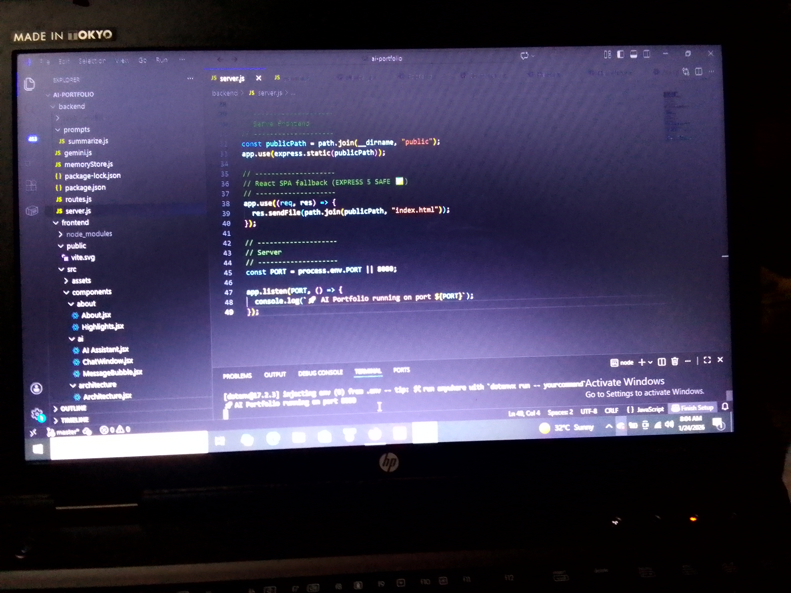

# AI-Powered Developer Portfolio  
### A Conversational, AI-First Portfolio for 2026

This project is my submission for the **New Year, New You Portfolio Challenge** by **DEV Community**, in collaboration with **Google AI**.

After studying **AI-driven systems and real-world agent architectures**, I redesigned my portfolio from a traditional static website into an **interactive, conversational experience** — one that demonstrates not just *what I’ve built*, but **how I think, design, and evolve systems in an AI-first world**.

Instead of scrolling through sections, visitors can **talk to an AI assistant** that understands context, remembers conversations, and adapts responses over time — reflecting where modern software is heading in **2026 and beyond**.

The application is fully containerized and deployed on **Google Cloud Run**.

---

## 🔄 What Changed After Studying AI-Driven Systems

Before exploring AI-driven architectures, my portfolio focused mainly on:
- Static project listings  
- Tool-based descriptions  
- Traditional “About Me” sections  

After studying **AI agents, memory systems, and context orchestration**, I made deliberate shifts:

- Presentation → **Interaction**
- Features → **Systems thinking**
- Static site → **Living AI product**
- Content → **Conversation & user intent**

This portfolio is now both:
- A **personal brand artifact**
- A **production-style AI system demonstration**

---

## 🚀 Key Features

- 🤖 **AI Assistant powered by Google Gemini**
- 🧠 **Conversation memory with automatic summarization**
- 🔁 **Context-aware responses that evolve during a session**
- ⚡ **Optimized for fast, scalable responses on Cloud Run**
- 🎨 **Modern UI with subtle motion and micro-interactions**
- ☁️ **Fully containerized and cloud-deployed**

---

## 🧠 AI Architecture Overview

The assistant uses a **layered memory architecture** inspired by production-grade AI agents.

### 🔥 WOW Feature Judges Don’t Expect
> This portfolio doesn’t just *use* AI — it **demonstrates agent architecture thinking**.

Instead of sending every message statelessly to Gemini, the system:

- Maintains short-term conversational memory  
- Automatically summarizes older context using Gemini itself  
- Injects compressed memory back into the system prompt  
- Adapts response depth based on detected user intent  

This mirrors **real-world AI agent design** — not demos.

---

## 🧱 Architecture Diagram

    ┌──────────────────────────────┐
    │          Frontend            │
    │        React + Vite          │
    │                              │
    │  ChatWindow.jsx              │
    │  ├─ MessageBubble.jsx        │
    │  ├─ Typing / Thinking UI     │
    │  ├─ Prompt Suggestions       │
    │  └─ Reset Memory Button      │
    └──────────────┬───────────────┘
                   │
                   │ User Messages (JSON)
                   ▼
    ┌──────────────────────────────┐
    │           Backend             │
    │       Node.js + Express       │
    │                              │
    │  routes.js                   │
    │  ├─ POST /ask                │
    │  ├─ POST /reset-memory       │
    │                              │
    │  gemini.js                   │
    │  ├─ System Prompt            │
    │  ├─ Intent Detection         │
    │  ├─ Adaptive Response Depth  │
    │                              │
    │  memoryStore.js              │
    │  ├─ Short-Term Memory        │
    │  ├─ Auto Summarization       │
    │  └─ Context Injection        │
    └──────────────┬───────────────┘
                   │
                   │ Structured Prompt + Memory
                   ▼
    ┌──────────────────────────────┐
    │        Google Gemini          │
    │                              │
    │  - Response Generation       │
    │  - Memory Summarization      │
    │  - Context Preservation     │
    └──────────────────────────────┘

---

## 🧠 Memory System Breakdown

### 1️⃣ Short-Term Memory  
Stores recent conversation turns for immediate contextual awareness.

### 2️⃣ Automatic Conversation Summarization  
When memory exceeds a safe threshold (e.g. 8+ messages), older messages are summarized using **Gemini**, preserving intent while reducing token usage.

### 3️⃣ Context Injection  
Summaries are injected into the system prompt so the assistant **remembers without bloating context**.

This balances:
- Performance  
- Cost efficiency  
- Scalability  
- User experience  

---

## 🖥️ Screenshots

> Click any screenshot to view it full-size.

### 🔹 Backend Running (Node.js Server)

### 🔹 API Test — Postman Request & Successful Response

### 🔹 Automatic Memory Summarization (After 8+ Messages)

### 🔹 Frontend UI Calling `/ask`

---

## 🖥️ User Experience & Ethical Design

- Clear distinction between **user** and **AI** messages  
- Animated message entry for natural conversational flow  
- Prompt suggestion chips to guide exploration  
- Typing / thinking indicators for realism  
- Explicit communication that the assistant remembers context  
- Optional conversation reset for transparent, ethical AI use  

---

## 🛠️ Tech Stack

### Frontend
- **React (Vite)**  
- Modular component architecture  
- Custom CSS with motion polish  

### Backend
- **Node.js (Express)**  
- Google Gemini API  
- Prompt engineering & memory orchestration  

### Infrastructure
- **Docker**
- **Google Cloud Run**

---

## 📁 Project Structure

    .
    ├── frontend
    │   ├── src
    │   │   ├── components
    │   │   │   ├── ai
    │   │   │   │   └── MessageBubble.jsx
    │   │   │   ├── hero
    │   │   │   ├── contact
    │   │   │   └── layout
    │   │   ├── styles
    │   │   │   └── global.css
    │   │   └── App.jsx
    │   └── index.html
    │
    ├── backend
    │   ├── prompts
    │   │   └── summarize.js
    │   ├── memoryStore.js
    │   ├── gemini.js
    │   ├── routes.js
    │   └── server.js
    │
    ├── screenshots
    ├── Dockerfile
    ├── .env
    └── README.md

---

## 🎯 Why This Portfolio Matters

This project represents:
- A shift toward **AI-first engineering**
- A focus on **systems, not just syntax**
- Continuous **learning, iteration, and growth**

Rather than telling visitors who I am, this portfolio lets them **experience how I build**.

---

## 📬 Connect With Me
 
- 🧑‍💻 GitHub: *(add link)*  
- 🔗 LinkedIn: *(https://www.linkedin.com/in/oboh-john-a42b59295)*
